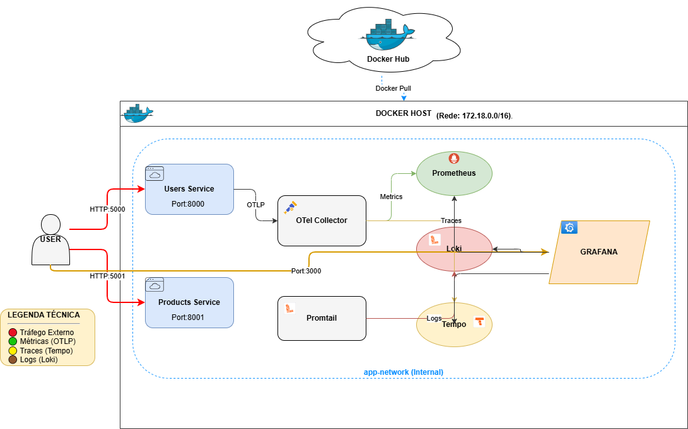
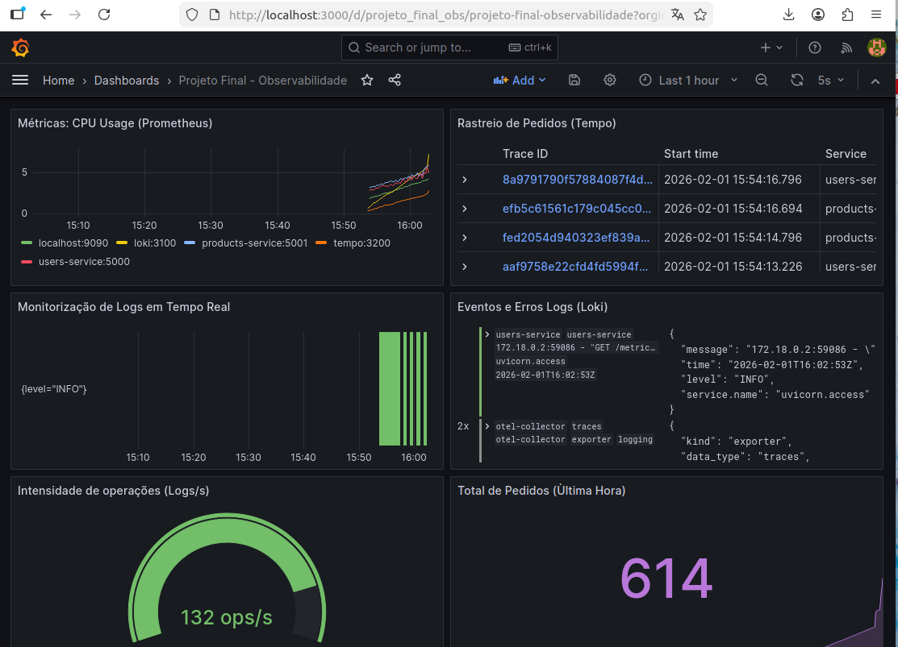

# 🏗️ Microservices Pipeline & Observability Stack
*A robust CI/CD workflow for Python Microservices with a focus on Security Hardening and Full-Stack Visibility.*

> [!NOTE]
> This project was developed as an integral part of the assessment for the **DevOps Engineering** course.

---

## 📋 Overview
This project implements a professional DevOps lifecycle for Python-based microservices. It demonstrates the transition from a standard development environment to a **production-ready, hardened, and observable ecosystem**. 

### 🎯 Key Engineering Pillars
* **CI/CD Automation:** Fully automated validation and deployment flow via GitHub Actions.
* **Full-Stack Observability:** Implementation of the **LGTM Stack** (Loki, Grafana, Tempo, Prometheus) for real-time monitoring.
* **Security-First Approach:** Integrated scanning with Trivy, Bandit, and Safety at every stage of the pipeline.
* **Zero-CVE Hardening:** Proactive vulnerability management by migrating from Debian to **Alpine Linux**.

---

## 📐 System Architecture (HLD)
The system follows a High-Level Design (HLD) that integrates application logic with a centralized telemetry collector and a secure delivery pipeline.

  

---
---

## 📊 Observability & Monitoring
The system is instrumented with **OpenTelemetry** to provide a "single pane of glass" view through a unified Grafana dashboard. This allows for real-time correlation between system metrics, centralized logs (Loki), and distributed traces (Tempo).

### 📸 System Insights

---

## 🛠️ Technology Stack
The tools selected for this project ensure a cloud-agnostic and highly scalable environment.

| Category | Tools |
| :--- | :--- |
| **Backend** | Python 3, FastAPI |
| **CI/CD** | GitHub Actions, Docker Hub |
| **Security** | Trivy, Bandit, Safety |
| **Observability** | Grafana, Loki, Tempo, Prometheus, OpenTelemetry |
| **Automation** | Makefile, Docker Compose |

---

## 🛡️ Security Hardening: The "Zero-CVE" Journey
A major technical milestone was achieving an **Unconditional Compliance** status through a strict hardening process.

* **The Problem:** The initial Debian-based image (`python:slim`) contained unpatchable vulnerabilities in `glibc` (e.g., CVE-2026-0861).
* **The Solution:** Migrated the entire stack to **Alpine Linux**, eliminating the OS-level attack surface.
* **Library Patching:** Resolved Protobuf vulnerabilities by enforcing version **6.33.5**.
* **Outcome:** Reached a verified **Zero-CVE** status without bypassing security checks or using `.trivyignore`.

---

## 🚀 Future Developments & Scalability
This project serves as a robust baseline for cloud-native growth. Future work would focus on:

* **Cloud Strategy & Procurement:** Comparative analysis of managed Kubernetes services (**Microsoft Azure AKS**, AWS EKS, or Google Cloud GKE) to determine the best provider.
* **Telemetry-Driven Capacity Planning:** Leveraging the **LGTM stack** to extract real-world performance metrics for "Right-sizing" cloud resources and optimizing FinOps.
* **Advanced Supply Chain Security:** Integrating automated **SBOM (Software Bill of Materials)** tools like Syft or Grype for proactive governance.
* **Infrastructure as Code (IaC):** Automating cloud provisioning using Terraform or Pulumi to maintain consistency across environments.

---

## 📖 Detailed Technical Reports and Future Improvements
For a deep dive into the engineering decisions and the security roadmap:

* 🇬🇧 **[Technical Report (English)](./TECHNICAL_REPORT_EN.md)** 
* 🇵🇹 **[Relatório Técnico (Português)](./RELATORIO_TECNICO_PT.md)** 

---

## 🧹 Maintenance & Development
* `make docker-up`: Initialize the environment.
* `make tests`: Run automated tests.
* `make clean`: Clean temporary files and containers.
